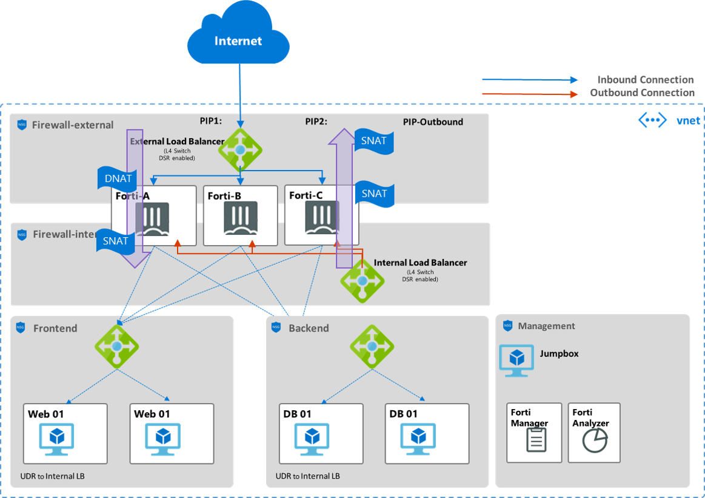

# Azure Terraform project for Fortigate NGFW

This is Azure terraform project for deploying web services VMs on Azure virtual network which is protected by Fortigate next generation firewall. Fortigate firewall VMs are deployed to Azure virtual network in High-Available and scalible (N Active-Active) configuration. This uses an Azure marketplace image, Fortigate 6.0.7 with BYOL license.

## Network Architecture


This terraform codes deploys N fortigate firewall instances in Active-Active modes along with Azure Standard load balancers. Each instance has 2 NIC configurations, one for external subnet and the other for internet subnet.

The use case scenarios include:
1. Inbound traffic from external Azure Standard Load Balancer is filtered at fortigate firewall instance and DNATed to internal service IP address (e.g. a internal basic load balancer frontend IP address which will distributes traffic to backend web service VMs)
2. Outbound traffic originated from frontend subnet is sent to internal Azure Standard Load Balancer which is then filtered at fortigate firewall instance before leaving virtual network.
3. inter-subnet traffic filtering. traffic from frontend subnet to backend subnet is sent to internal Azure Standard Load Balancer which is then filtered at fortigate firewalll instance and then sent to destination subnet. 
4. The scenarios above can be extended to multiple VNETs environment in hub-and-spoke architecture. 

## How to use this Fortigate NGFW module

This module is designed as a Azure landing zone whose concepts are documented at https://docs.microsoft.com/en-us/azure/cloud-adoption-framework/ready/expanded-scope/terraform-landing-zone.

Usually, this Fortigate NGFW landing zone would be deployed on top of lower landing zones especially CAF(Cloud Adaption Framework) "foundational" landing zone and "networking" landing zone. In this case, some terraform variables values can be retrieved from output variables in lower landing zones backends.

However, you can also use this landing zone as standalone module without dependency to the lower landing zones. In this case, you should enter all the variables needed as input terraform variable file. (e.g. terraform.tfvars)

To deploy this module, refer below example on Ubuntu (Bash shell)

```
# 0. go to "firewall" directory
$ cd firewall

# 1. Run "terraform init" with setting variables below. 
$ terraform init \
  -reconfigure \
  -backend=true \
  -lock=false \
  -backend-config storage_account_name=${storage_account_name} \
  -backend-config container_name=${container} \
  -backend-config access_key=${access_key} \
  -backend-config key=${tf_name}
  
# 2. Run "terraform plan" to check Fortigate module resources configuration to be created.
$ terraform plan 

# 3. Run "terraform apply" to deploy Fortigate module resources.
$ terraform apply
```
If you are using azure terraform landing zone launchpad (https://github.com/aztfmod/level0), variables for backend configuration can be retrieved from Azure Keyvault which is created from launchpad. In this case you can replace "terraform init" step with running "./firewall/terraform_init.sh" script to retrieve and set environmental variables and set terraform variables from the environmental variable.
```
$ . terraform_init.sh
```

## terraform configuration files structure
**./firewall_services.tf** 
Deploy the following sub-modules
- public_ip_address : A set of IP addresses which will be assigned to external Azure Standard Load Balancer frontends and used for inbound connection and creating DNAT rule at fortigate FW. 
- public_ip_address_outbound: A set of IP addresses which will be assigned to external Azure Standard Load Balancer Frontend and used for outbound connection.
- external_load_balancer: external Azure Standard Load Balancer with an inbound backend and an outbound backend of fortigate VMs. 
- internal_load_balancer: internal Azure Standard Load Balancer which will be used for load balancing for outbound connection. "HA Port" rule is enabled. HA port enables load balancing on all fortigate ports and provides flow symmetricity for ingress and egress traffic which is required for Active-Active high availability configuration with multiple fortigate instances.
- fortigate: A set of fortigate instances wich 2 NICs. Each 1st NIC is associated to external Azure Standard Load Balancer backend pool and each 2nd NIC is associated to internal Azure Standard Load Balancer backend
- fortimanager: Deploys a fortimanager VM which will manage and apply FW rules in centralized manner.
- fortianalyzer: Deploys fortianalyzer which will provides reporting and analzyer features. 
**./main.tf** 
Defines terraform backend and set variables

**./variables.tf** 
Declare input variables

**./outputs.tf** 
Declare output variables

**./terraform.tfvar** 
Defines input variables. Includes sample input variables values

**./prepare_fortigtate_bootstrap.sh**
Fortigate instance requires bootstraping to configure time zone, admin port, interface configurations, and etc as well as apply license file. This script will upload configuration file ("config.txt") and license files(license-01.lic, license-02.lic, ...) to Azure Blob Storage, create SAS key for the blob URLs, and create customdata-%02d.txt files which contains those URLs. This customdata-%02d.txt file is refered at os_profile item of the fortigate VM terraform resource(azurerm_virtual_machine resource). When each fortigate VM boots for the first time, it will download the configuration file and license file and apply those automatically.

Below is a sample customdata-01.txt files.
```
{"config-url": "https://mystorageaccount.blob.core.windows.net/mycontainer/pathtoblob/config.txt",
"license-url": "https://mystorageaccount.blob.core.windows.net/mycontainer/pathtoblob/license-01.lic"}
```

**./config.txt**
Sample configuration file for fortigate instance which is used for cloud-init.

## Bootstrapping Fortigate instances
Running Fortigate instance requires license and initial boot straping as described below link.
https://docs.fortinet.com/vm/azure/fortigate/5.6/deploying-fortigate-on-azure/5.6.0/295297/bootstrapping-the-fortigate-cli-and-byol-license-at-initial-bootup-using-user-data

Below is 
Refer ./prepare_fortigtate_bootstrap.sh script for bootstrapping automation.

To check if the bootstraping with cloud-init is performed successfully, log-in to fortigate instance using ssh and use the command below.
```
# diag debug cloudinit show
```

If you want to re-do cloud-init on already running fortigate VM, use the command below to factory-reset the instance.
```
# exec factoryreset
```


## Tenical Notes
